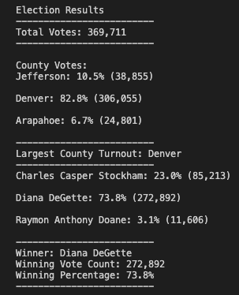

# Election_Analysis

## Project overview

In an effort to assist the Colorado Board of Elections, the following tasks were completed to help audit recent election results. 
1. Calculate the total numver of votes cast
2. Provide a breakdown for each count regarding votes and percentage of total
3. Identify county having greatest number of votes
4. Compile a complete list of candidates receiving votes
5. Calculate the total number of votes each candidate received
6. Calculate the percentage of the total votes each candidate received
7. Report the winner of the election

## Resources

Data Source: election_results.csv
Software: Python 3.10.1, Visual Studio Code, 1.65.0

## Election-Audit Results

The analysis of the election show that:
1. There were 369,711 votes cast in the election
2. The results by county were:
    * Jefferson: 10.5%,  38,855 votes
    * Denver:    82.8%, 306,055 votes
    * Arapahoe:   6.7%,  24,801 votes
3. The county having the greatest number of votes:
    * Denver
4. The candidates who received votes:
    * Charles Casper Stockham
    * Diana DeGette
    * Raymon Anthony Doane
5. The percentage of total votes for each candidate: 
    * Charles Casper Stockham: 23.0% of the total vote 
    * Diana DeGette:           73.8% of the total vote 
    * Raymon Anthony Doane:     3.1% of the total vote 
6. The total votes per candidate:
    * Charles Casper Stockham:  85,213 votes
    * Diana DeGette recieved:  272,892 votes
    * Raymon Anthony Doane:     11,606 votes
7. The winner of the election was:
    * Diana DeGette who recieved 73.8% of the total vote with 272,892 votes

## Election-Audit Summary
This script may be used to help automate other election data. Assuming the Board of Elections has the same data for other districts the script could be modified to read another set of records and either print to the same report or a new report per district. If other records are organized differently, the script may need to be modified but the core algorithm will still be applicable. Additionally, if the board would like to build onto the findings reported through this script, code could be written to add additional calculations to the script for reporting. 
